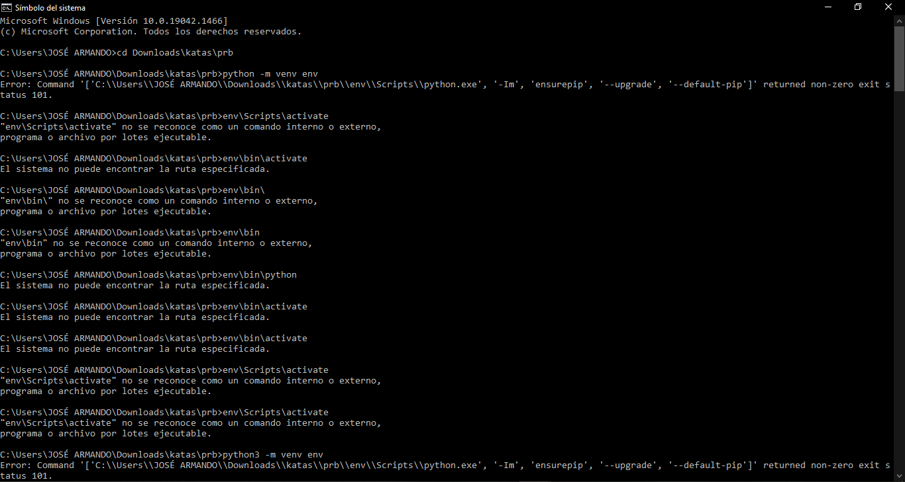
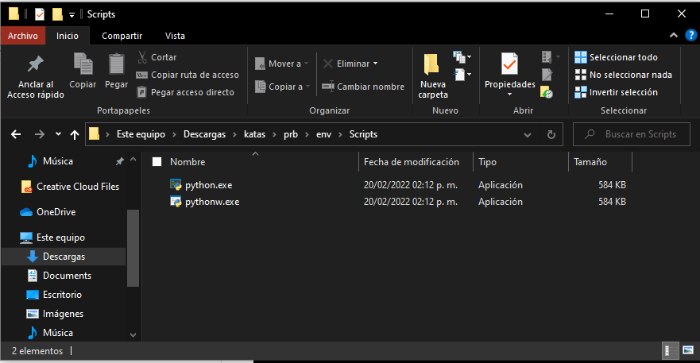

No funciono la kata 2 ya que tuve muchos problemas para hacer funcionar el kernel y la unica solucion que encuentro para que pueda funcionar esta kata 2 es reinstalar Python, pero como me costo trabajo que funcionara no le quise mover.

Dejo captura que si realice dicha actividad.

Dejo captura de lo que pone en la carpeta env/Scripts se puede observar que no se encuentra el archivoactivate

